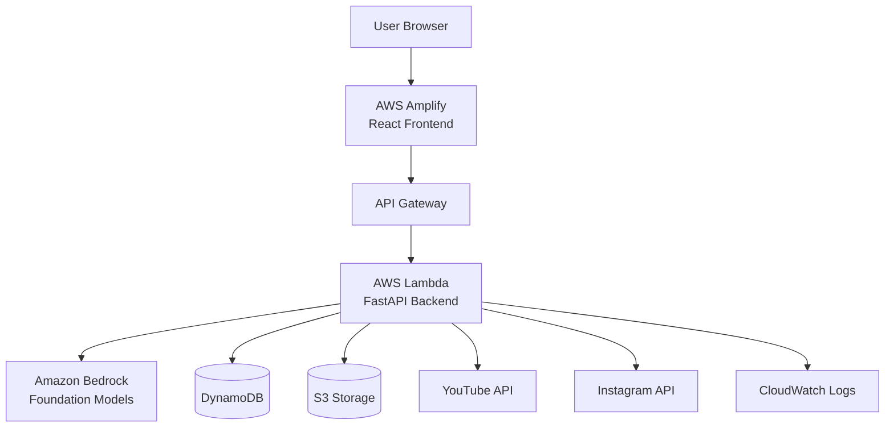

# Design Document: Crevo Platform

## Overview

Crevo is an AI-powered content intelligence and creation platform built on AWS serverless architecture. The system follows a three-tier architecture with a React frontend hosted on AWS Amplify, a Python FastAPI backend running on AWS Lambda, and data persistence using DynamoDB and S3.

The platform's core workflow consists of:
1. User authentication and social media account connection
2. Content data retrieval from social platforms (YouTube, Instagram)
3. Performance analysis using statistical methods
4. AI-powered content generation via Amazon Bedrock
5. Content organization in a weekly calendar interface

The design prioritizes simplicity, cost-efficiency, and hackathon-friendly implementation while maintaining production-ready patterns for authentication, error handling, and data management.

## Architecture

### High-Level Architecture



### Architecture Principles

1. **Serverless-First**: Use AWS Lambda for compute to minimize operational overhead and costs
2. **API-Driven**: Clear separation between frontend and backend via RESTful APIs
3. **Stateless Backend**: All state stored in DynamoDB, enabling horizontal scaling
4. **Prompt-Based AI**: Use foundation models via Amazon Bedrock without custom training
5. **Cost-Conscious**: Leverage AWS Free Tier and pay-per-use services


## Components and Interfaces

### Frontend Components (React)

#### 1. Authentication Component
- **Purpose**: Handle user login and session management
- **Key Functions**:
  - `login(email, password)`: Authenticate user credentials
  - `logout()`: Terminate user session
  - `checkAuthStatus()`: Verify current authentication state
- **State Management**: Store auth token in localStorage, user info in React context
- **API Calls**: POST `/api/auth/login`, POST `/api/auth/logout`

#### 2. Dashboard Component
- **Purpose**: Main interface integrating analytics, creation, and calendar
- **Key Functions**:
  - `fetchAnalytics()`: Retrieve performance insights
  - `displayInsights(data)`: Render analytics visualizations
  - `navigateToView(viewName)`: Switch between analytics, create, calendar views
- **Sub-Components**:
  - AnalyticsPanel: Display performance metrics and insights
  - CreateButton: Prominent button triggering content generation modal
  - NavigationBar: Switch between main views
- **API Calls**: GET `/api/analytics/insights`

#### 3. Social Account Connection Component
- **Purpose**: Connect and manage social media accounts
- **Key Functions**:
  - `initiateOAuth(platform)`: Start OAuth flow for YouTube or Instagram
  - `handleOAuthCallback(code)`: Process OAuth callback
  - `selectDemoMode()`: Use sample data without connection
- **State**: Connected accounts list, connection status
- **API Calls**: POST `/api/accounts/connect`, GET `/api/accounts/list`

#### 4. Content Creation Modal
- **Purpose**: Interface for selecting and generating content types
- **Key Functions**:
  - `selectContentType(type)`: Choose Idea, Video, or Image
  - `generateContent(type, params)`: Trigger AI generation
  - `displayGeneratedContent(content)`: Show results
  - `saveContent(content)`: Persist generated content
- **State**: Selected type, generation status, generated content
- **API Calls**: POST `/api/content/generate`

#### 5. Content Calendar Component
- **Purpose**: Weekly calendar view of planned content
- **Key Functions**:
  - `fetchWeeklyContent(startDate)`: Get content for week
  - `renderCalendar(contentItems)`: Display calendar grid
  - `viewContentDetails(itemId)`: Show full content item
- **State**: Current week, content items, selected item
- **API Calls**: GET `/api/content/calendar`

### Backend Components (Python FastAPI)

#### 1. Authentication Service
- **Purpose**: Handle user authentication and session management
- **Key Functions**:
  ```python
  def authenticate_user(email: str, password: str) -> AuthToken
  def validate_token(token: str) -> User
  def create_session(user_id: str) -> Session
  ```
- **Dependencies**: DynamoDB (users table), JWT library
- **Security**: Password hashing with bcrypt, JWT tokens with expiration

#### 2. Social Account Service
- **Purpose**: Manage social media account connections
- **Key Functions**:
  ```python
  def initiate_oauth(platform: str, user_id: str) -> OAuthURL
  def handle_oauth_callback(code: str, platform: str) -> AccessToken
  def store_credentials(user_id: str, platform: str, token: AccessToken) -> bool
  def get_connected_accounts(user_id: str) -> List[Account]
  ```
- **Dependencies**: DynamoDB (accounts table), OAuth libraries
- **External APIs**: YouTube OAuth, Instagram OAuth

#### 3. Content Retrieval Service
- **Purpose**: Fetch content data from social platforms
- **Key Functions**:
  ```python
  def fetch_youtube_videos(access_token: str, max_results: int) -> List[Video]
  def fetch_instagram_posts(access_token: str, max_results: int) -> List[Post]
  def extract_performance_metrics(content: Union[Video, Post]) -> Metrics
  def store_content_data(user_id: str, content: List[ContentItem]) -> bool
  ```
- **Dependencies**: YouTube Data API, Instagram Graph API, DynamoDB
- **Error Handling**: Rate limit handling, retry with exponential backoff

#### 4. Analytics Service
- **Purpose**: Analyze content performance and identify patterns
- **Key Functions**:
  ```python
  def calculate_aggregate_metrics(content_items: List[ContentItem]) -> AggregateMetrics
  def identify_top_performers(content_items: List[ContentItem], limit: int) -> List[ContentItem]
  def detect_posting_patterns(content_items: List[ContentItem]) -> PostingPatterns
  def identify_best_content_types(content_items: List[ContentItem]) -> Dict[str, float]
  def generate_insights(metrics: AggregateMetrics, patterns: PostingPatterns) -> Insights
  ```
- **Algorithm**: Simple statistical analysis (mean, median, percentiles)
- **Dependencies**: DynamoDB (content_data table)

#### 5. AI Generation Service
- **Purpose**: Generate content using Amazon Bedrock
- **Key Functions**:
  ```python
  def generate_idea(insights: Insights, user_preferences: dict) -> IdeaContent
  def generate_video_script(insights: Insights, user_preferences: dict) -> VideoContent
  def generate_image_concept(insights: Insights, user_preferences: dict) -> ImageContent
  def build_prompt(content_type: str, insights: Insights) -> str
  def call_bedrock_api(prompt: str, model_id: str) -> str
  ```
- **Dependencies**: Amazon Bedrock (Claude or Titan models), DynamoDB
- **Prompt Strategy**: Include performance insights, best-performing patterns, content type requirements

#### 6. Content Storage Service
- **Purpose**: Persist and retrieve generated content
- **Key Functions**:
  ```python
  def save_content_item(user_id: str, content: ContentItem) -> str
  def get_content_items(user_id: str, filters: dict) -> List[ContentItem]
  def get_weekly_content(user_id: str, start_date: date) -> List[ContentItem]
  def upload_image_to_s3(image_data: bytes, user_id: str) -> str
  def generate_signed_url(s3_key: str, expiration: int) -> str
  ```
- **Dependencies**: DynamoDB (content_items table), S3 (content-assets bucket)
- **Data Model**: Partition key: user_id, Sort key: timestamp

### API Endpoints

#### Authentication Endpoints
- `POST /api/auth/login`: Authenticate user
  - Request: `{email: string, password: string}`
  - Response: `{token: string, user: User}`
- `POST /api/auth/logout`: Terminate session
  - Request: `{token: string}`
  - Response: `{success: boolean}`

#### Account Management Endpoints
- `POST /api/accounts/connect`: Initiate OAuth connection
  - Request: `{platform: string}`
  - Response: `{oauth_url: string}`
- `GET /api/accounts/callback`: Handle OAuth callback
  - Query Params: `code, state, platform`
  - Response: Redirect to dashboard
- `GET /api/accounts/list`: Get connected accounts
  - Response: `{accounts: List[Account]}`

#### Analytics Endpoints
- `GET /api/analytics/insights`: Get performance insights
  - Response: `{insights: Insights, top_performers: List[ContentItem]}`
- `POST /api/analytics/refresh`: Trigger content data refresh
  - Response: `{status: string, updated_count: int}`

#### Content Generation Endpoints
- `POST /api/content/generate`: Generate content
  - Request: `{type: string, preferences: dict}`
  - Response: `{content: ContentItem, id: string}`

#### Content Management Endpoints
- `GET /api/content/calendar`: Get weekly content
  - Query Params: `start_date`
  - Response: `{content_items: List[ContentItem]}`
- `GET /api/content/{id}`: Get specific content item
  - Response: `{content: ContentItem}`


## Data Models

### User Model
```python
{
  "user_id": "string (UUID)",           # Partition key
  "email": "string",
  "password_hash": "string",
  "created_at": "timestamp",
  "last_login": "timestamp"
}
```

### Social Account Model
```python
{
  "user_id": "string",                  # Partition key
  "platform": "string",                 # Sort key (youtube, instagram)
  "access_token": "string (encrypted)",
  "refresh_token": "string (encrypted)",
  "token_expiry": "timestamp",
  "account_name": "string",
  "connected_at": "timestamp"
}
```

### Content Data Model (Retrieved from Social Platforms)
```python
{
  "user_id": "string",                  # Partition key
  "content_id": "string",               # Sort key (platform_id)
  "platform": "string",
  "content_type": "string",             # video, image, post
  "title": "string",
  "description": "string",
  "posted_at": "timestamp",
  "metrics": {
    "views": "number",
    "likes": "number",
    "comments": "number",
    "reach": "number",
    "engagement_rate": "number"
  },
  "retrieved_at": "timestamp"
}
```

### Generated Content Model
```python
{
  "user_id": "string",                  # Partition key
  "created_at": "timestamp",            # Sort key
  "content_id": "string (UUID)",
  "content_type": "string",             # idea, video, image
  "status": "string",                   # draft, scheduled, published
  "data": {
    # For Idea type:
    "concept": "string",
    "hook": "string",
    "caption": "string",
    "hashtags": "List[string]",
    
    # For Video type:
    "script": "string",
    "scenes": "List[SceneBreakdown]",
    "voiceover": "string",
    
    # For Image type:
    "visual_concept": "string",
    "headline": "string",
    "caption": "string",
    "image_url": "string (S3 URL)"
  },
  "generation_params": {
    "insights_used": "dict",
    "model_id": "string"
  }
}
```

### Insights Model (Cached Analytics)
```python
{
  "user_id": "string",                  # Partition key
  "generated_at": "timestamp",          # Sort key
  "aggregate_metrics": {
    "total_content": "number",
    "avg_views": "number",
    "avg_engagement": "number",
    "total_reach": "number"
  },
  "top_performers": "List[content_id]",
  "best_content_types": "Dict[string, float]",
  "posting_patterns": {
    "best_times": "List[hour]",
    "best_days": "List[day]",
    "frequency": "number"
  },
  "ttl": "timestamp"                    # Cache expiration
}
```

### DynamoDB Table Design

#### Users Table
- **Table Name**: `crevo-users`
- **Partition Key**: `user_id` (String)
- **Attributes**: email, password_hash, created_at, last_login

#### Accounts Table
- **Table Name**: `crevo-accounts`
- **Partition Key**: `user_id` (String)
- **Sort Key**: `platform` (String)
- **Attributes**: access_token, refresh_token, token_expiry, account_name, connected_at

#### Content Data Table
- **Table Name**: `crevo-content-data`
- **Partition Key**: `user_id` (String)
- **Sort Key**: `content_id` (String)
- **GSI**: `platform-posted_at-index` for querying by platform and time
- **Attributes**: platform, content_type, title, description, posted_at, metrics, retrieved_at

#### Generated Content Table
- **Table Name**: `crevo-generated-content`
- **Partition Key**: `user_id` (String)
- **Sort Key**: `created_at` (Number - timestamp)
- **GSI**: `content_id-index` for direct content lookup
- **Attributes**: content_id, content_type, status, data, generation_params

#### Insights Cache Table
- **Table Name**: `crevo-insights`
- **Partition Key**: `user_id` (String)
- **Sort Key**: `generated_at` (Number - timestamp)
- **TTL Attribute**: `ttl` (auto-delete after 24 hours)
- **Attributes**: aggregate_metrics, top_performers, best_content_types, posting_patterns

### S3 Bucket Structure

**Bucket Name**: `crevo-content-assets`

```
/users/{user_id}/
  /images/
    /{content_id}.png
    /{content_id}.jpg
  /generated/
    /{content_id}_concept.png
```

**Access Pattern**: Generate signed URLs with 1-hour expiration for frontend access


## Correctness Properties

*A property is a characteristic or behavior that should hold true across all valid executions of a system—essentially, a formal statement about what the system should do. Properties serve as the bridge between human-readable specifications and machine-verifiable correctness guarantees.*

### Property 1: Valid Authentication Grants Access
*For any* valid user credentials (email and password), authenticating with those credentials should grant access to the dashboard and return a valid authentication token.
**Validates: Requirements 1.1**

### Property 2: Invalid Authentication is Rejected
*For any* invalid user credentials (wrong password, non-existent email, malformed input), authentication attempts should be rejected with an appropriate error message.
**Validates: Requirements 1.2**

### Property 3: Logout Invalidates Session
*For any* authenticated user session, logging out and then attempting to access protected resources should require re-authentication.
**Validates: Requirements 1.4**

### Property 4: OAuth Flow Generates Valid URLs
*For any* supported social media platform (YouTube, Instagram), initiating OAuth should generate a valid OAuth URL containing the correct platform-specific parameters.
**Validates: Requirements 2.2**

### Property 5: OAuth Credentials Persistence Round-Trip
*For any* successful OAuth authentication, storing the credentials and then retrieving them should return equivalent credential data.
**Validates: Requirements 2.3**

### Property 6: Platform-Specific API Selection
*For any* connected social media account, fetching content should call the correct platform-specific API (YouTube Data API for YouTube, Instagram Graph API for Instagram).
**Validates: Requirements 3.1**

### Property 7: Retrieved Content Completeness
*For any* content fetched from social media platforms, the retrieved data should include all required performance metrics: views, likes, comments, reach, and posting time.
**Validates: Requirements 3.2**

### Property 8: Rate Limit Retry with Exponential Backoff
*For any* API call that encounters a rate limit error, the retry delays should follow an exponential backoff pattern (e.g., 1s, 2s, 4s, 8s).
**Validates: Requirements 3.3**

### Property 9: Content Retrieval Persistence Round-Trip
*For any* content data retrieved from social platforms, storing it in DynamoDB and then querying for it should return equivalent content data.
**Validates: Requirements 3.4**

### Property 10: Aggregate Metrics Calculation Correctness
*For any* set of content items with performance metrics, the calculated aggregate metrics (average views, average engagement, total reach) should match manual calculation results.
**Validates: Requirements 4.1**

### Property 11: Top Performers Ranking Correctness
*For any* set of content items, the identified top performers should be correctly ranked by engagement score (weighted combination of views, likes, comments, reach), with higher scores appearing first.
**Validates: Requirements 4.2**

### Property 12: Posting Pattern Correlation Accuracy
*For any* set of content items with timestamps and performance metrics, the detected posting time patterns should correctly identify time periods with above-average performance.
**Validates: Requirements 4.3**

### Property 13: Best Content Type Identification
*For any* set of content items with type labels, the identified best-performing content types should be ranked by average engagement score per type.
**Validates: Requirements 4.4**

### Property 14: Content Generation Produces Valid Output
*For any* content type (idea, video, image) and valid user insights, the AI generation should produce content with a non-empty response and valid structure.
**Validates: Requirements 5.1, 6.1, 7.1**

### Property 15: Generated Content Completeness by Type
*For any* generated content item, it should contain all required fields for its type:
- Ideas: concept, hook, caption, hashtags
- Videos: script, scenes, voiceover
- Images: visual_concept, headline, caption
**Validates: Requirements 5.2, 6.2, 7.2**

### Property 16: Prompt Construction Includes Insights
*For any* content generation request, the constructed prompt should include the user's performance insights and best-performing content patterns.
**Validates: Requirements 5.3, 6.3, 7.3**

### Property 17: Generated Content Persistence Round-Trip
*For any* generated content item, saving it to DynamoDB and then retrieving it by content_id should return equivalent content data with matching unique identifier and timestamp.
**Validates: Requirements 5.5, 6.5, 7.5, 8.1**

### Property 18: Image File S3 Storage and Reference
*For any* generated image content with an image file, the file should be stored in S3 and the DynamoDB record should contain a valid S3 URL that references the stored file.
**Validates: Requirements 7.6, 8.2**

### Property 19: User Content Retrieval Completeness
*For any* user with generated content items, retrieving their saved content should return all and only the content items belonging to that user, with all required attributes (type, creation timestamp, generation parameters) present.
**Validates: Requirements 8.3, 8.4**

### Property 20: S3 Signed URL Generation Validity
*For any* S3 object key, generating a signed URL should produce a valid URL that allows access to the object within the expiration period.
**Validates: Requirements 8.5**

### Property 21: Calendar Content Sorted by Date
*For any* set of content items, organizing them for the calendar should result in items sorted in ascending order by creation timestamp.
**Validates: Requirements 9.2**

### Property 22: Weekly Calendar Date Filtering
*For any* week start date, retrieving weekly content should return only content items with creation timestamps within that 7-day period.
**Validates: Requirements 9.3**

### Property 23: API Request Validation
*For any* API request, if the request has invalid parameters or missing authentication tokens, it should be rejected with a 400 or 401 status code; if valid, it should be processed.
**Validates: Requirements 11.3**

### Property 24: Error Response Status Code Correctness
*For any* API error type (authentication failure, validation error, server error, not found), the response should include the appropriate HTTP status code (401, 400, 500, 404 respectively).
**Validates: Requirements 11.4**

### Property 25: S3 Key Organization Pattern
*For any* file stored in S3, the object key should follow the pattern `/users/{user_id}/{content_type}/{content_id}.{extension}`.
**Validates: Requirements 12.4**

### Property 26: Generation Failure Retry Availability
*For any* AI generation request that fails, the system should log the error and return a response indicating that retry is available.
**Validates: Requirements 13.2**

### Property 27: Database Retry Exponential Backoff
*For any* database operation that fails with a retryable error, the retry attempts should follow exponential backoff timing.
**Validates: Requirements 13.3**

### Property 28: External Service Call Timeout
*For any* external service call (social media APIs, Bedrock API), the call should timeout and return an error if it exceeds the configured timeout duration.
**Validates: Requirements 13.5**


## Error Handling

### Frontend Error Handling

#### Network Errors
- **Scenario**: API calls fail due to network issues
- **Handling**: Display user-friendly error message, provide retry button, cache last successful state
- **Implementation**: Axios interceptors with retry logic

#### Authentication Errors
- **Scenario**: Token expires or becomes invalid
- **Handling**: Redirect to login page, clear local storage, display session expired message
- **Implementation**: Check for 401 responses in API interceptor

#### Validation Errors
- **Scenario**: User input fails validation
- **Handling**: Display inline error messages, highlight invalid fields, prevent form submission
- **Implementation**: Form validation with React Hook Form or similar

#### Loading States
- **Scenario**: Long-running operations (content generation, data fetching)
- **Handling**: Display loading spinners, progress indicators, disable action buttons
- **Implementation**: Loading state management in React components

### Backend Error Handling

#### External API Errors

**Social Media API Failures**:
```python
try:
    response = youtube_api.fetch_videos(access_token)
except RateLimitError as e:
    # Implement exponential backoff
    retry_after = e.retry_after or calculate_backoff(attempt)
    await asyncio.sleep(retry_after)
    # Retry with backoff
except AuthenticationError as e:
    # Token expired or invalid
    return {"error": "authentication_failed", "message": "Please reconnect your account"}
except APIError as e:
    # General API error
    log_error(e)
    return {"error": "api_error", "message": "Unable to fetch content data"}
```

**Amazon Bedrock Errors**:
```python
try:
    response = bedrock_client.invoke_model(prompt, model_id)
except ThrottlingException as e:
    # Rate limited by Bedrock
    await asyncio.sleep(calculate_backoff(attempt))
    # Retry
except ModelTimeoutException as e:
    # Model took too long
    return {"error": "generation_timeout", "message": "Content generation timed out, please try again"}
except BedrockException as e:
    # General Bedrock error
    log_error(e)
    return {"error": "generation_failed", "message": "Unable to generate content"}
```

#### Database Errors

**DynamoDB Errors**:
```python
try:
    table.put_item(Item=content_item)
except ProvisionedThroughputExceededException as e:
    # Throttled by DynamoDB
    await asyncio.sleep(calculate_backoff(attempt))
    # Retry with exponential backoff
except ConditionalCheckFailedException as e:
    # Item already exists or condition not met
    return {"error": "conflict", "message": "Content item already exists"}
except ClientError as e:
    # General DynamoDB error
    log_error(e)
    return {"error": "database_error", "message": "Unable to save content"}
```

**S3 Errors**:
```python
try:
    s3_client.put_object(Bucket=bucket, Key=key, Body=image_data)
except NoSuchBucket as e:
    # Bucket doesn't exist
    log_critical_error(e)
    return {"error": "storage_error", "message": "Storage configuration error"}
except ClientError as e:
    # General S3 error
    log_error(e)
    return {"error": "storage_error", "message": "Unable to store image file"}
```

#### Validation Errors

**Request Validation**:
```python
from pydantic import BaseModel, ValidationError

class ContentGenerationRequest(BaseModel):
    content_type: str  # Must be 'idea', 'video', or 'image'
    user_id: str
    preferences: dict

try:
    request = ContentGenerationRequest(**request_data)
except ValidationError as e:
    return JSONResponse(
        status_code=400,
        content={"error": "validation_error", "details": e.errors()}
    )
```

#### Timeout Handling

**External Service Timeouts**:
```python
import asyncio

async def call_external_api_with_timeout(api_call, timeout=30):
    try:
        return await asyncio.wait_for(api_call(), timeout=timeout)
    except asyncio.TimeoutError:
        log_error(f"API call timed out after {timeout}s")
        raise TimeoutException(f"Operation timed out after {timeout} seconds")
```

### Error Logging Strategy

**CloudWatch Logging Levels**:
- **ERROR**: Failed operations that affect user experience (API failures, generation errors)
- **WARNING**: Recoverable issues (rate limits, retries)
- **INFO**: Successful operations, user actions
- **DEBUG**: Detailed execution flow (development only)

**Structured Logging Format**:
```python
import json
import logging

logger = logging.getLogger()

def log_error(error, context):
    logger.error(json.dumps({
        "timestamp": datetime.utcnow().isoformat(),
        "error_type": type(error).__name__,
        "error_message": str(error),
        "user_id": context.get("user_id"),
        "operation": context.get("operation"),
        "trace_id": context.get("trace_id")
    }))
```

### Retry Strategy

**Exponential Backoff Implementation**:
```python
def calculate_backoff(attempt: int, base_delay: float = 1.0, max_delay: float = 60.0) -> float:
    """Calculate exponential backoff delay with jitter"""
    delay = min(base_delay * (2 ** attempt), max_delay)
    jitter = random.uniform(0, delay * 0.1)  # Add 10% jitter
    return delay + jitter

async def retry_with_backoff(operation, max_attempts=3):
    """Retry operation with exponential backoff"""
    for attempt in range(max_attempts):
        try:
            return await operation()
        except RetryableError as e:
            if attempt == max_attempts - 1:
                raise
            delay = calculate_backoff(attempt)
            await asyncio.sleep(delay)
```


## Testing Strategy

### Dual Testing Approach

The Crevo platform will use both unit testing and property-based testing to ensure comprehensive coverage:

- **Unit tests**: Verify specific examples, edge cases, and error conditions
- **Property tests**: Verify universal properties across all inputs

Both testing approaches are complementary and necessary. Unit tests catch concrete bugs and validate specific scenarios, while property tests verify general correctness across a wide range of inputs.

### Property-Based Testing

**Library Selection**:
- **Python Backend**: Use `hypothesis` library for property-based testing
- **JavaScript Frontend**: Use `fast-check` library for property-based testing

**Configuration**:
- Each property test must run a minimum of 100 iterations
- Each test must reference its corresponding design document property
- Tag format: `# Feature: crevo-platform, Property {number}: {property_text}`

**Example Property Test Structure (Python)**:
```python
from hypothesis import given, strategies as st
import pytest

@given(
    email=st.emails(),
    password=st.text(min_size=8, max_size=100)
)
def test_valid_authentication_grants_access(email, password):
    """
    Feature: crevo-platform, Property 1: Valid Authentication Grants Access
    For any valid user credentials, authenticating should grant access
    """
    # Setup: Create user with credentials
    user = create_test_user(email, password)
    
    # Execute: Authenticate
    result = authenticate_user(email, password)
    
    # Assert: Access granted with valid token
    assert result.success is True
    assert result.token is not None
    assert result.user_id == user.user_id
```

**Example Property Test Structure (JavaScript)**:
```javascript
import fc from 'fast-check';

describe('Content Calendar', () => {
  it('Property 21: Calendar content sorted by date', () => {
    // Feature: crevo-platform, Property 21: Calendar Content Sorted by Date
    fc.assert(
      fc.property(
        fc.array(contentItemArbitrary()),
        (contentItems) => {
          const organized = organizeForCalendar(contentItems);
          
          // Verify sorted in ascending order by timestamp
          for (let i = 1; i < organized.length; i++) {
            expect(organized[i].created_at).toBeGreaterThanOrEqual(
              organized[i-1].created_at
            );
          }
        }
      ),
      { numRuns: 100 }
    );
  });
});
```

### Unit Testing Strategy

**Backend Unit Tests (Python with pytest)**:

**Test Categories**:
1. **Authentication Tests**: Login, logout, token validation, session management
2. **Social Account Tests**: OAuth flow, credential storage, account listing
3. **Content Retrieval Tests**: API calls, data parsing, error handling
4. **Analytics Tests**: Metric calculation, pattern detection, insight generation
5. **AI Generation Tests**: Prompt construction, Bedrock API calls, response parsing
6. **Storage Tests**: DynamoDB operations, S3 uploads, data retrieval

**Example Unit Test**:
```python
def test_oauth_callback_stores_credentials():
    """Test that successful OAuth callback stores credentials in DynamoDB"""
    # Arrange
    user_id = "test-user-123"
    platform = "youtube"
    oauth_code = "test-oauth-code"
    mock_token = {"access_token": "token123", "refresh_token": "refresh123"}
    
    # Act
    result = handle_oauth_callback(oauth_code, platform, user_id)
    
    # Assert
    assert result.success is True
    stored_account = get_account(user_id, platform)
    assert stored_account.access_token is not None
    assert stored_account.platform == platform
```

**Frontend Unit Tests (JavaScript with Jest and React Testing Library)**:

**Test Categories**:
1. **Component Rendering Tests**: Verify components render correctly
2. **User Interaction Tests**: Button clicks, form submissions, navigation
3. **State Management Tests**: Context updates, local storage
4. **API Integration Tests**: Mock API calls, response handling
5. **Error Display Tests**: Error messages, validation feedback

**Example Unit Test**:
```javascript
import { render, screen, fireEvent } from '@testing-library/react';
import CreateButton from './CreateButton';

test('Create button displays content type options when clicked', () => {
  render(<CreateButton />);
  
  const createButton = screen.getByText('Create');
  fireEvent.click(createButton);
  
  expect(screen.getByText('Idea')).toBeInTheDocument();
  expect(screen.getByText('Video')).toBeInTheDocument();
  expect(screen.getByText('Image')).toBeInTheDocument();
});
```

### Integration Testing

**API Integration Tests**:
- Test complete API flows from request to response
- Use test DynamoDB tables and S3 buckets
- Mock external services (YouTube API, Instagram API, Bedrock)

**Example Integration Test**:
```python
def test_content_generation_end_to_end():
    """Test complete content generation flow"""
    # Setup
    user_id = create_test_user()
    add_test_insights(user_id)
    
    # Execute
    response = client.post(
        "/api/content/generate",
        json={"content_type": "idea", "user_id": user_id},
        headers={"Authorization": f"Bearer {get_test_token(user_id)}"}
    )
    
    # Assert
    assert response.status_code == 200
    content = response.json()
    assert content["content_type"] == "idea"
    assert "concept" in content["data"]
    assert "hook" in content["data"]
    
    # Verify persistence
    stored = get_content_item(content["content_id"])
    assert stored is not None
```

### Edge Cases and Error Conditions

**Critical Edge Cases to Test**:
1. Empty content data (no social media posts)
2. Single content item (insufficient data for patterns)
3. All content with zero engagement
4. Expired OAuth tokens
5. Rate limit scenarios
6. Network timeouts
7. Invalid content type requests
8. Malformed API responses
9. S3 storage failures
10. DynamoDB throttling

**Example Edge Case Test**:
```python
def test_analytics_with_empty_content_data():
    """Test that analytics handles empty content gracefully"""
    user_id = create_test_user()
    # No content data added
    
    insights = generate_insights(user_id)
    
    assert insights.aggregate_metrics.total_content == 0
    assert insights.top_performers == []
    assert insights.message == "No content data available for analysis"
```

### Test Coverage Goals

**Backend Coverage Targets**:
- Overall code coverage: >80%
- Critical paths (auth, generation, storage): >90%
- Error handling paths: >70%

**Frontend Coverage Targets**:
- Component coverage: >75%
- User interaction flows: >85%
- Error handling: >70%

### Continuous Testing

**Pre-commit Hooks**:
- Run unit tests for changed files
- Run linting and type checking

**CI/CD Pipeline**:
1. Run all unit tests
2. Run property-based tests (100 iterations each)
3. Run integration tests
4. Generate coverage reports
5. Deploy only if all tests pass

**Test Execution Commands**:
```bash
# Backend tests
pytest tests/ --cov=src --cov-report=html

# Backend property tests
pytest tests/properties/ --hypothesis-show-statistics

# Frontend tests
npm test -- --coverage

# Frontend property tests
npm test -- --testPathPattern=properties
```

